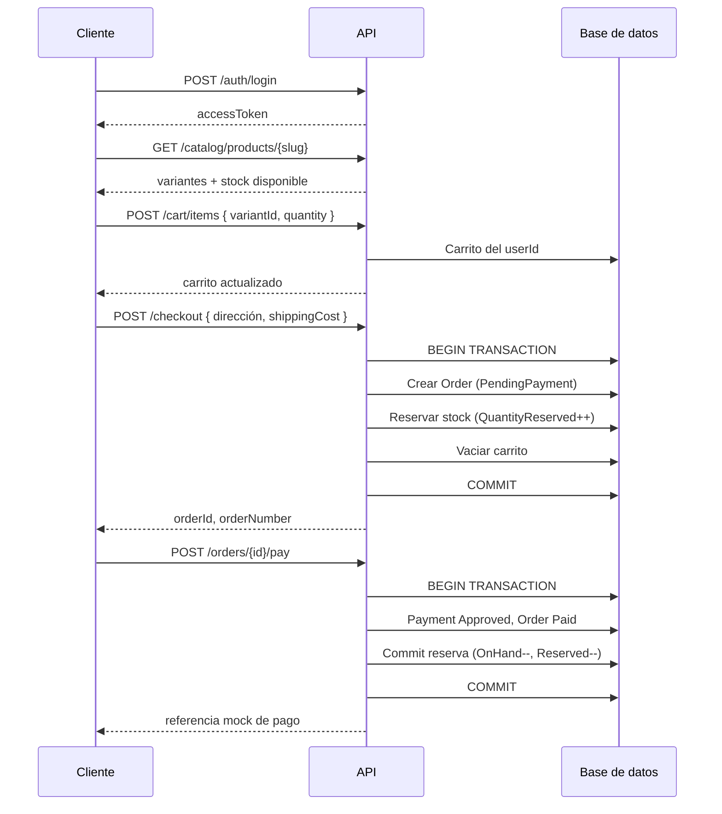

# Flujos de negocio

## 1. Compra (cliente autenticado)

### Reserva de stock (checkout)

- Por cada línea se valida `OnHand - Reserved >= quantity`.
- Si falla → `409 InsufficientStockException`.
- Se crean registros en `stock_reservations` con expiración (30 min).
- `QuantityReserved` aumenta; el stock físico no baja hasta el pago.

### Pago mock

- Solo pedidos en `PendingPayment`.
- En transacción: aprueba pago, pasa orden a `Paid`, ejecuta `CommitReservationAsync`.
- `CommitReservationAsync` reduce `QuantityOnHand` y `QuantityReserved`, elimina reservas, registra movimiento `Sale`.

## 2. Carrito invitado (guest)

1. `GET /cart` o `POST /cart/items` sin JWT.
2. Opcional: header `X-Guest-Token: {guid}` en siguientes llamadas.
3. Si no hay token, la API genera `GuestToken` en el carrito nuevo.
4. El checkout **requiere login** (solo usuarios autenticados pagan).

## 3. Flujo admin — despacho

**Precondición:** pedido en estado `Paid`.

| Paso | Endpoint | Efecto |
|------|----------|--------|
| 1 | `POST /admin/orders/{id}/ready` | `Paid` → `ReadyToDispatch` |
| 2 | `POST /admin/shipments` | Crea `Shipment` + `DispatchTicket`, orden → `Dispatched` |
| 3 | `GET /admin/shipments/{id}/ticket.pdf` | Genera PDF con QuestPDF |

## 4. Validación de entrada

Todos los POST/PUT con body usan `ValidationFilter<T>`:

1. Postman/cliente envía JSON.
2. FluentValidation valida el DTO (`Validators/*`).
3. Si falla → `400` con `errors` por campo.
4. Si pasa → el servicio ejecuta la lógica.

## 5. Manejo de errores

`ExceptionMiddleware` mapea:

| Excepción | HTTP |
|-----------|------|
| `NotFoundException` | 404 |
| `InsufficientStockException` | 409 |
| `InvalidOperationException` | 400 |
| Otros | 500 |

## 6. Servicios por caso de uso

| Servicio | Responsabilidad |
|----------|-----------------|
| `AuthService` | Register, login, refresh, logout, me |
| `CatalogService` | Familias, listado, detalle público |
| `CartService` | CRUD carrito |
| `CheckoutService` | Checkout transaccional |
| `OrderService` | Consulta y pago del cliente |
| `AdminCatalogService` | CRUD catálogo |
| `InventoryService` | Consulta y ajuste de stock |
| `AdminOrderService` | Gestión pedidos admin |
| `AdminShipmentService` | Envíos, conductores, PDF |

## 7. Qué revisar en un code review

| Área | Preguntas útiles |
|------|------------------|
| Seguridad | ¿Secret JWT en producción? ¿HTTPS? |
| Stock | ¿Reservas expiradas se liberan? (pendiente: job de limpieza) |
| Transacciones | ¿Rollback en checkout/pago si falla a mitad? |
| Permisos | ¿Cada endpoint admin tiene `.RequireAuthorization` correcto? |
| Tests | ¿Flujos críticos cubiertos en integración? |
| BD | ¿Migraciones EF para producción vs `EnsureCreated`? |
