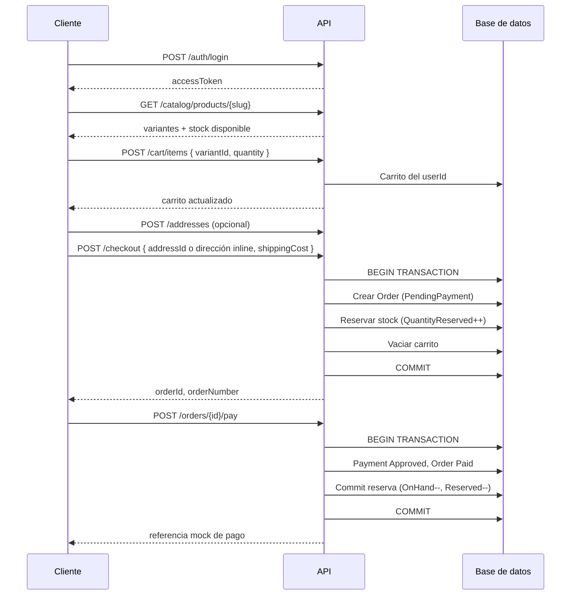

# Flujos de negocio

## 1. Compra (cliente autenticado)

### Handlers involucrados

| Paso | Command / Query |
|------|-----------------|
| Login | `LoginCommand` |
| Catálogo | `GetProductBySlugQuery` |
| Carrito | `AddCartItemCommand` |
| Dirección | `SaveAddressCommand` |
| Checkout | `CreateOrderCommand` |
| Pago | `PayOrderCommand` |

### Reserva de stock (checkout)

- Por cada línea se valida `OnHand - Reserved >= quantity`.
- Si falla → `Result` con código `InsufficientStock` → HTTP **409**.
- Se crean registros en `stock_reservations` con expiración (30 min).
- `QuantityReserved` aumenta; el stock físico no baja hasta el pago.

### Pago mock

- Solo pedidos en `PendingPayment` o `PaymentFailed`.
- En transacción: aprueba pago, pasa orden a `Paid`, ejecuta `CommitReservationAsync`.
- `CommitReservationAsync` reduce `QuantityOnHand` y `QuantityReserved`, elimina reservas, registra movimiento `Sale`.

## 2. Carrito invitado (guest)

1. `GET /cart` o `POST /cart/items` sin JWT.
2. Opcional: header `X-Guest-Token: {guid}` en siguientes llamadas.
3. Si no hay token, la API genera `GuestToken` en el carrito nuevo.
4. Tras `POST /auth/login`, `POST /cart/merge` con `{ "guestToken": "..." }` (`MergeCartCommand`).
5. `DELETE /cart` → `ClearCartCommand`; `PATCH /cart/items/{id}` → `UpdateCartItemCommand`.
6. El checkout **requiere login** (solo usuarios autenticados).

## 2a. Perfil y cancelación (Fase 2)

1. `PATCH /auth/me` actualiza nombre y teléfono.
2. `POST /auth/change-password` valida contraseña actual y revoca refresh tokens.
3. `POST /orders/{id}/cancel` solo en `PendingPayment` o `PaymentFailed`: libera reserva de stock y pasa a `Cancelled`.
4. `GET /orders/{id}/tracking` devuelve estado del pedido y envío (tracking, repartidor).

## 2b. Direcciones del cliente

1. `POST /addresses` → `SaveAddressCommand` (opcional `isDefault: true`).
2. `PATCH /addresses/{id}/default` → `SetDefaultAddressCommand`.
3. Checkout: `POST /checkout` con `{ "addressId": "...", "shippingCost": 99 }` o dirección inline.

## 3. Flujo admin — despacho

**Precondición:** pedido en estado `Paid`.

| Paso | Endpoint | Command / Query | Efecto |
|------|----------|-----------------|--------|
| 1 | `PATCH` o `POST .../ready-to-dispatch` | `MarkOrderReadyToDispatchCommand` | `Paid` → `ReadyToDispatch` |
| 2 | `POST /admin/shipments` | `CreateShipmentCommand` | Shipment + ticket; orden → `Dispatched` |
| 3 | `GET .../ticket.pdf` o `.../orders/{id}/ticket` | `GenerateShipmentTicketPdfQuery` / `GenerateOrderTicketPdfQuery` | PDF QuestPDF |
| 4 | `PATCH .../in-transit` | `MarkShipmentInTransitCommand` | `InTransit` |
| 5 | `PATCH .../delivered` | `MarkShipmentDeliveredCommand` | `Delivered` |

## 4. Validación

### Entrada (FluentValidation + MediatR)

1. Cliente envía JSON → endpoint construye **Command**.
2. `ValidationBehavior` ejecuta `IValidator<TCommand>`.
3. Si falla → `Result` con `Validation` → HTTP **400** (`ValidationProblem`).
4. Si ok → handler.

Validadores en `Application/Features/*/Validators/`.

### Dominio

Reglas en `Domain` (`AddressRules`, `OrderErrors`, etc.) evaluadas **dentro del handler** antes de persistir.

## 5. Manejo de errores

### FluentResults (flujo normal)

| Metadata `Code` | HTTP |
|-----------------|------|
| `Validation` | 400 |
| `Unauthorized` | 401 |
| `NotFound` | 404 |
| `Conflict` / `InsufficientStock` | 409 |

### ExceptionMiddleware (fallos excepcionales)

| Excepción | HTTP |
|-----------|------|
| `NotFoundException` | 404 |
| `InsufficientStockException` | 409 |
| `InvalidOperationException` | 400 |
| Otros | 500 |

## 6. Handlers por área (referencia)

| Módulo | Archivo principal | Responsabilidad |
|--------|-------------------|-----------------|
| Auth | `Features/Auth/AuthHandlers.cs` | Register, login, refresh, logout, me |
| Catalog | `Features/Catalog/Queries/CatalogQueries.cs` | Lectura pública |
| Cart | `Features/Cart/CartHandlers.cs` | CRUD carrito, merge |
| Checkout | `Features/Checkout/CheckoutHandlers.cs` | Crear pedido transaccional |
| Orders | `Features/Orders/OrderHandlers.cs` | Listado, detalle, pago cliente |
| Addresses | `Features/Addresses/` | CRUD direcciones |
| Admin | `Features/Admin/AdminHandlers.cs` | Dashboard, covers, catálogo, stock, pedidos, envíos, opciones |

## 7. Qué revisar en un code review

| Área | Preguntas útiles |
|------|------------------|
| Seguridad | ¿Secret JWT en producción? ¿HTTPS? |
| Stock | ¿Job de limpieza de reservas expiradas? (pendiente) |
| Transacciones | ¿Rollback en checkout/pago si falla a mitad? |
| Permisos | ¿Cada endpoint admin tiene `.RequireAuthorization` correcto? |
| CQRS | ¿Nuevas rutas usan command/query + `Result`, no excepciones para 404/409? |
| Tests | ¿Flujos críticos en integración? |
| BD | ¿Migraciones EF para producción vs `EnsureCreated`? |
