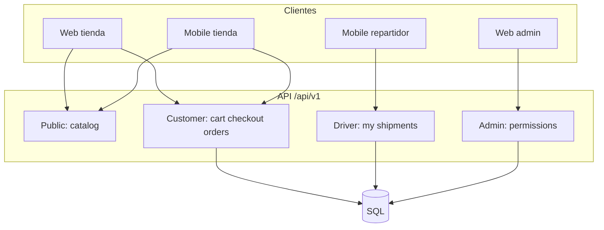

# Plan de completitud del backend — Web, mobile tienda y mobile repartidor

Documento maestro por **fases**. Cada fase tiene entregables, rutas nuevas y criterios de aceptación para que **web** (tienda + admin) y **mobile** (cliente + repartidor) puedan consumir la misma API.

**Estado del análisis:** mayo 2026, tras migración CQRS completa.

---

## Resumen ejecutivo

| Cliente | Qué necesita hoy | Qué falta (priorizado) |
|---------|------------------|------------------------|
| **Web tienda** | Catálogo, carrito guest, checkout, pago mock, pedidos | Tracking envío, cancelar pedido, cupones, wishlist, perfil |
| **Mobile tienda** | Misma API + JWT + refresh | Igual que web + push, pagos reales, deep links |
| **Web admin** | Catálogo, pedidos, envíos, conductores CRUD | Gestión usuarios/roles, reportes, reasignar envíos |
| **Mobile repartidor** | **Nada** (sin API propia) | Registro, login, mis envíos, cambiar estado, POD |

| Backend hoy | Brecha principal |
|-------------|------------------|
| `Driver` = ficha admin sin login | No hay cuenta repartidor ni app API |
| `POST /auth/register` genérico | No asignaba rol `customer` |
| JWT sin roles | Mobile no distingue cliente/repartidor/admin solo con token |
| Envío en admin | Cliente no ve tracking en `GET /orders/{id}` |

---

## Arquitectura objetivo (tres apps, una API)



**Prefijos de rutas objetivo:**

| Prefijo | Rol | Uso |
|---------|-----|-----|
| `/catalog`, `/auth/register/customer` | Público / registro | Web + mobile tienda |
| `/cart`, `/checkout`, `/orders`, `/addresses` | `customer` | Compra |
| `/driver/*` | `driver` | App repartidor |
| `/admin/*` | `admin` + permisos | Panel |

---

## Fase 1 — Identidad y registro separado ✅ (en curso)

**Objetivo:** Cuentas correctas para cliente y repartidor; JWT con roles; API mínima repartidor.

### Entregables

| # | Tarea | Estado |
|---|--------|--------|
| 1.1 | Rol `driver` en seed + `RoleCodes` | ✅ |
| 1.2 | `Driver.UserId` enlazado a `User` | ✅ |
| 1.3 | `POST /auth/register/customer` asigna rol `customer` | ✅ |
| 1.4 | `POST /auth/register/driver` crea User + Driver | ✅ |
| 1.5 | JWT incluye claim `role` por cada rol del usuario | ✅ |
| 1.6 | `GET /driver/me`, `GET /driver/shipments` | ✅ |
| 1.7 | `PATCH /driver/shipments/{id}/in-transit\|delivered` | ✅ |
| 1.8 | Usuario demo repartidor en seed | ✅ |
| 1.9 | `GET /orders/{id}` incluye tracking para cliente | ✅ |

### Rutas nuevas

```
POST /api/v1/auth/register/customer
POST /api/v1/auth/register/driver
GET  /api/v1/driver/me
GET  /api/v1/driver/shipments
PATCH /api/v1/driver/shipments/{id}/in-transit
PATCH /api/v1/driver/shipments/{id}/delivered
```

`POST /auth/register` se mantiene como alias de **customer** (compatibilidad Postman).

### Criterios de aceptación

- Registro cliente → login → `Roles` contiene `customer`.
- Registro repartidor → login → `Roles` contiene `driver` y `UserDto.DriverId` informado.
- Repartidor solo ve envíos asignados a su `DriverId`.
- Al marcar entregado, `Shipment` y `Order` pasan a `Delivered`.

---

## Fase 2 — Perfil cliente y pedidos (web + mobile tienda) ✅

**Objetivo:** Cuenta usable sin llamar solo a `/auth/me`.

| # | Tarea | Estado |
|---|--------|--------|
| 2.1 | `PATCH /auth/me` — actualizar nombre, teléfono | ✅ |
| 2.2 | `POST /auth/change-password` (revoca refresh tokens) | ✅ |
| 2.3 | `POST /orders/{id}/cancel` (`PendingPayment` / `PaymentFailed`) | ✅ |
| 2.4 | `GET /orders/{id}/tracking` | ✅ |
| 2.5 | `GET /orders?page&pageSize&total` paginado | ✅ |
| 2.6 | `GET /orders?status=` filtro por estado | ✅ |
| 2.7 | Detalle pedido incluye `shipment` (tracking en GET `/{id}`) | ✅ |

### Rutas nuevas Fase 2

```
PATCH /api/v1/auth/me
POST  /api/v1/auth/change-password
GET   /api/v1/orders?page=1&pageSize=20&status=Paid
GET   /api/v1/orders/{id}/tracking
POST  /api/v1/orders/{id}/cancel
```

---

## Fase 3 — Pagos reales y webhooks ⏸️ (mock permanente)

**Decisión:** Se mantiene el pago simulado (`POST /orders/{id}/pay` → referencia `MOCK-{guid}`). No se implementa pasarela real en este curso.

| # | Tarea | Estado |
|---|--------|--------|
| 3.1 | `IPaymentGateway` + implementación mock/real | ⏸️ mock |
| 3.2 | `POST /checkout` devuelve `paymentIntent` o URL | ⏸️ |
| 3.3 | Webhook `POST /webhooks/payments/{provider}` | ⏸️ |
| 3.4 | Idempotencia y reconciliación | ⏸️ |
| 3.5 | Reintento y `PaymentFailed` documentado | ⏸️ |

---

## Fase 4 — Catálogo enriquecido (conversión) ✅

| # | Tarea | Web/mobile | Estado |
|---|--------|------------|--------|
| 4.1 | Opciones en `GET /catalog/products/{slug}` | Ficha producto | ✅ |
| 4.2 | `POST /catalog/products/{slug}/resolve-variant` | Selector talla/color | ✅ |
| 4.3 | `optionValueIds` en listados | Filtros | ✅ |
| 4.4 | Wishlist (`/wishlist`) | Favoritos | ✅ |
| 4.5 | Reseñas (`/catalog/products/{slug}/reviews`) | Social proof | ✅ |
| 4.6 | Cupones (`couponCode` en checkout) | Promos | ✅ |
| 4.7 | Upload imágenes (blob + URL) | Admin | Pendiente |

### Rutas nuevas Fase 4

```
GET    /api/v1/catalog/products?optionValueIds={guid},{guid}
POST   /api/v1/catalog/products/{slug}/resolve-variant
GET    /api/v1/catalog/products/{slug}/reviews
POST   /api/v1/catalog/products/{slug}/reviews
GET    /api/v1/wishlist
POST   /api/v1/wishlist/{productId}
DELETE /api/v1/wishlist/{productId}
POST   /api/v1/checkout  (body: couponCode opcional)
```

Cupón demo en seed: `WELCOME10` (10 %, mínimo subtotal 50).

---

## Fase 5 — Mobile repartidor completo

| # | Tarea |
|---|--------|
| 5.1 | `GET /driver/shipments/{id}` detalle (dirección, ítems, teléfono cliente) |
| 5.2 | Proof of delivery: foto/firma (`POST .../proof`) |
| 5.3 | `PATCH .../picked-up` estado intermedio |
| 5.4 | Notificaciones push (FCM) al asignar envío |
| 5.5 | Disponibilidad on/off del repartidor |
| 5.6 | Admin: aprobar registro repartidor (`IsApproved`) |

---

## Fase 6 — Admin y operaciones

| # | Tarea |
|---|--------|
| 6.1 | CRUD usuarios y asignación de roles |
| 6.2 | Dashboard con rangos de fechas y ventas |
| 6.3 | Reasignar conductor / cancelar envío |
| 6.4 | Movimientos de stock (`GET /admin/stock/movements`) |
| 6.5 | Auditoría (`audit_logs` + interceptor) |
| 6.6 | Export CSV pedidos / inventario |

---

## Fase 7 — Notificaciones y engagement

| # | Tarea |
|---|--------|
| 7.1 | Email transaccional (pedido confirmado, enviado) |
| 7.2 | Plantillas + cola (Hangfire / Azure Service Bus) |
| 7.3 | Push tokens por usuario (`DeviceRegistration`) |
| 7.4 | In-app notifications inbox |

---

## Fase 8 — Producción y DX

| # | Tarea |
|---|--------|
| 8.1 | EF Migrations (sustituir solo `EnsureCreated` en prod) |
| 8.2 | Rate limiting por IP / por usuario |
| 8.3 | Versionado API `/api/v2` cuando haya breaking changes |
| 8.4 | Health checks Redis/BD cola |
| 8.5 | OpenAPI tags por app (Store, Driver, Admin) |

---

## Matriz: qué consume cada app

| Recurso | Web tienda | Mobile tienda | Web admin | Mobile driver |
|---------|------------|---------------|-----------|---------------|
| Catalog | ✅ | ✅ | — | — |
| Cart guest + merge | ✅ | ✅ | — | — |
| Auth customer | ✅ | ✅ | — | — |
| Auth driver | — | — | — | ✅ Fase 1 |
| Orders + tracking | ✅ Fase 1–2 | ✅ | — | — |
| Driver shipments | — | — | vista | ✅ Fase 1 |
| Admin CRUD | — | — | ✅ | — |
| Pagos reales | Fase 3 | Fase 3 | — | — |
| Push | — | Fase 7 | — | Fase 7 |

---

## Orden recomendado de implementación

1. **Fase 1** — Sin esto mobile repartidor no existe.  
2. **Fase 2** — Mejora experiencia tienda web/mobile.  
3. **Fase 3** — Negocio real cobra.  
4. **Fase 5** — Completa app repartidor.  
5. **Fase 4** — Marketing y conversión.  
6. **Fase 6–8** — Escala operativa.

---

## Referencias en el repo

| Tema | Documento |
|------|-----------|
| Rutas actuales | [03-api-endpoints.md](./03-api-endpoints.md) |
| Auth JWT | [04-autenticacion-y-permisos.md](./04-autenticacion-y-permisos.md) |
| Flujos | [06-flujos-de-negocio.md](./06-flujos-de-negocio.md) |
| vs Laravel | [07-comparativa-rutas-laravel.md](./07-comparativa-rutas-laravel.md) |
| Principiantes | [00-guia-para-principiantes.md](./00-guia-para-principiantes.md) |

---

## Changelog del plan

| Fecha | Cambio |
|-------|--------|
| 2026-05 | Creación del plan; inicio Fase 1 (registro customer/driver + API driver) |
| 2026-05 | Fase 3 marcada como mock permanente; Fase 4 implementada (opciones, wishlist, reseñas, cupones) |
